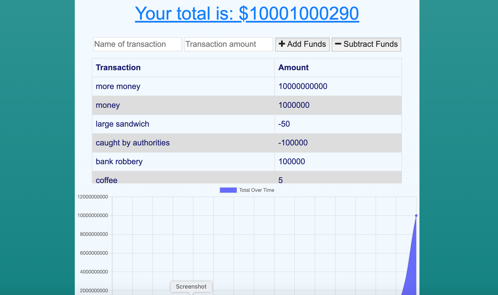

# budget_tracker
A tracker... for a budget
    

# Description
    
This app keeps track of the user's budget. It runs in node using an express server. When online, it uses a Mongo database. It utilizes an Indexed DB to store user data when offline. The data is moved to the main DB when the app is connected again.

